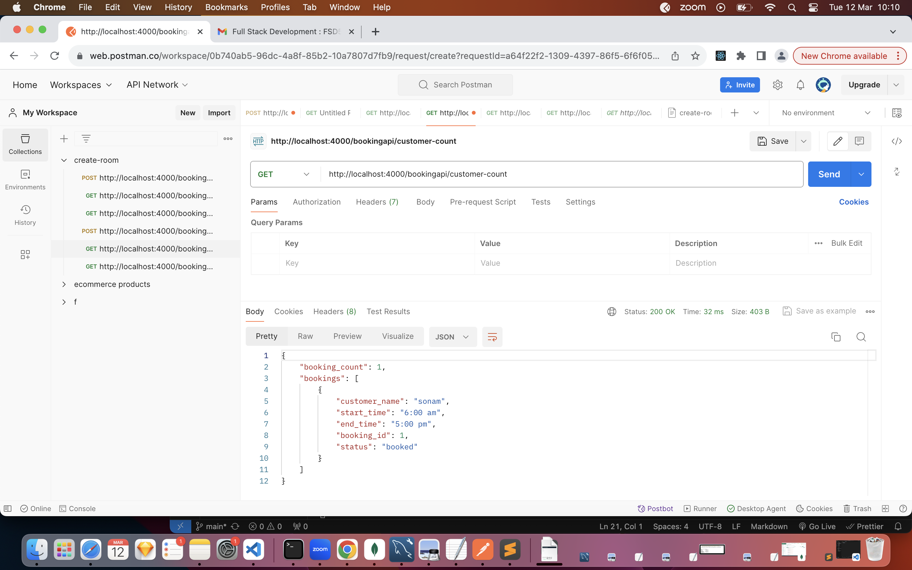

1. Created express server
2. Created endpoints /api for createroom, bookroom, listallroom, bookingcount,customerdetails.
3. Created api documentation in postman .

4. https://web.postman.co/workspace/0b740ab5-96dc-4a8f-85b2-10a7807d7fb9/request/33139018-afa360a3-f75c-41be-8aff-e17a420902ba

5.  Stored room details with data id, room_name, room_status, seats, price_per_hour. get method => http://localhost:4000/bookingapi/get-bookinginfo 
6.  created room api with post call =>http://localhost:4000/bookingapi/create-room 
7. Bookroom with data id, name, starttime , endtime post call => http://localhost:4000/bookingapi/book-room
8. List all rooms - get call => http://localhost:4000/bookingapi/list-of-rooms
9. list all cutomers - get call => http://localhost:4000/bookingapi/customer-details
10. booking coiunt - get call => http://localhost:4000/bookingapi/customer-count

## book room (POST)

## customer details(GET) 

## list of roomz  (GET)

## create room api(POST)

## Room api booking info(GET) 

## Booking count (GET) ## => 

